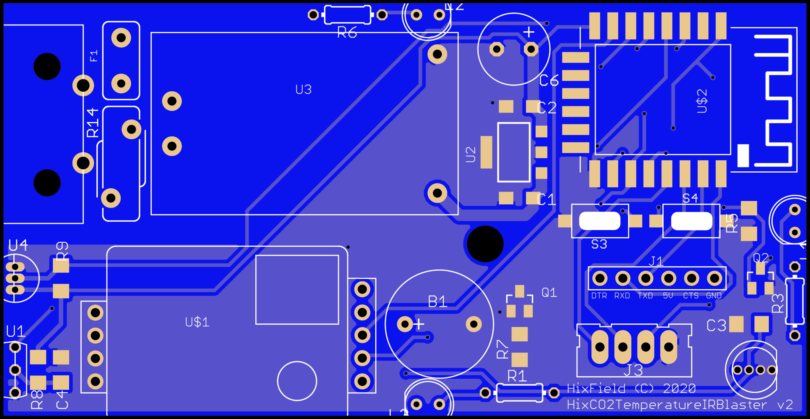
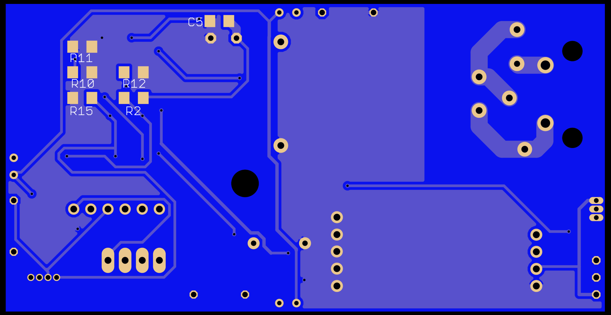
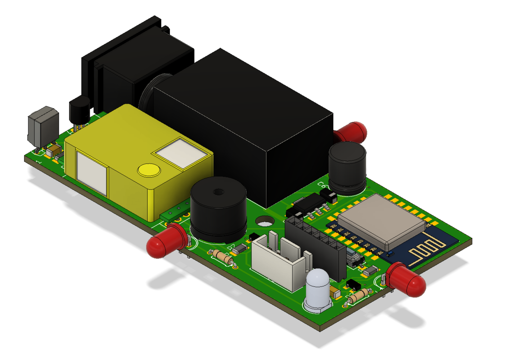
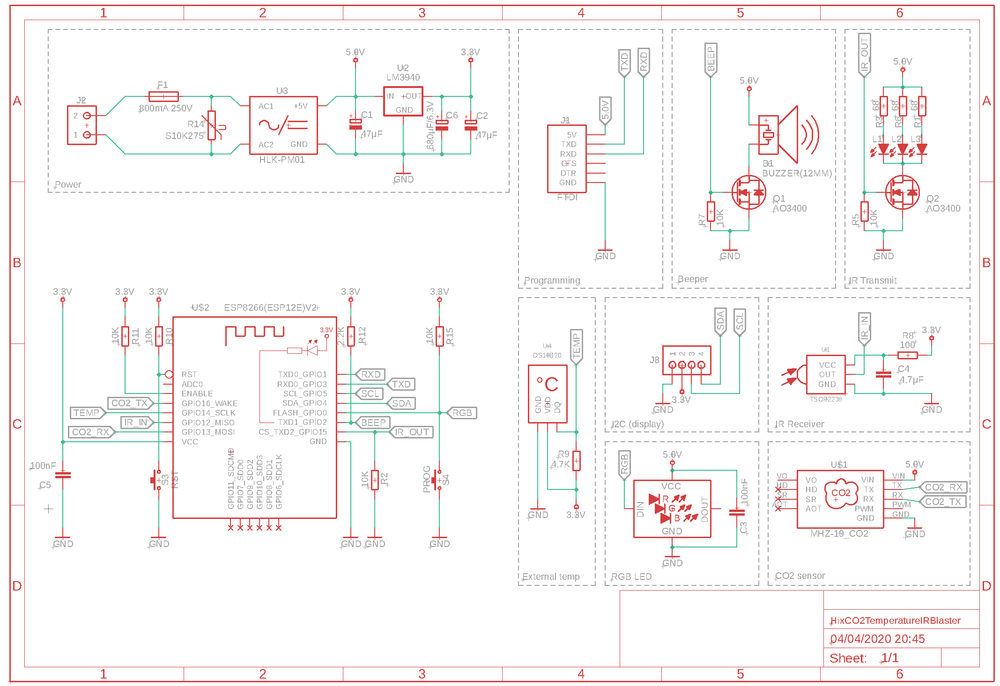
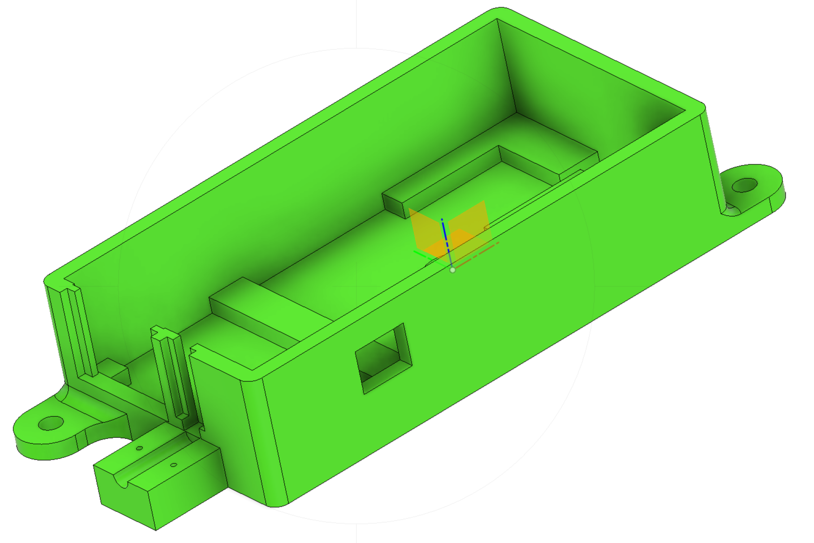
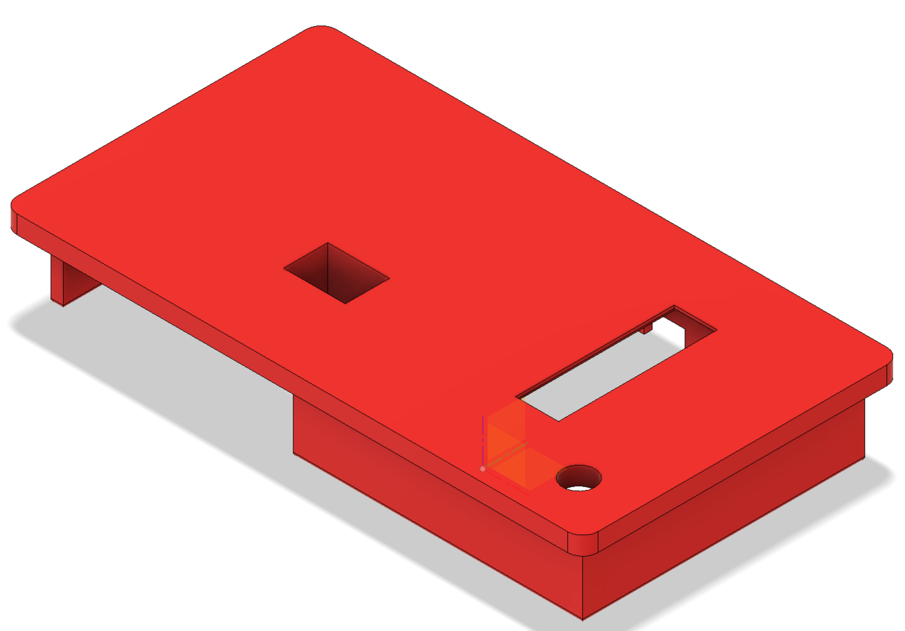
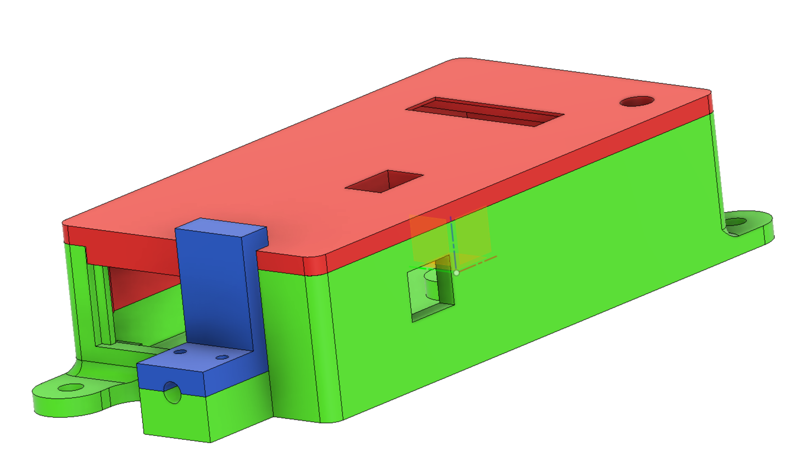
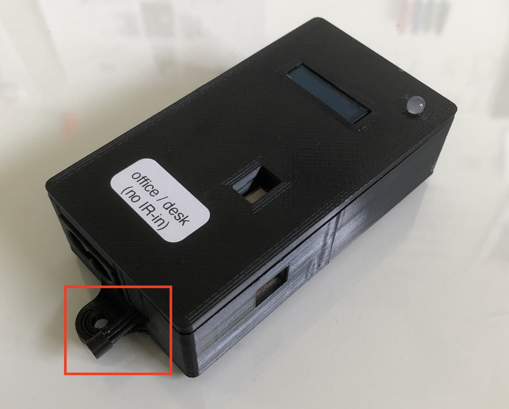
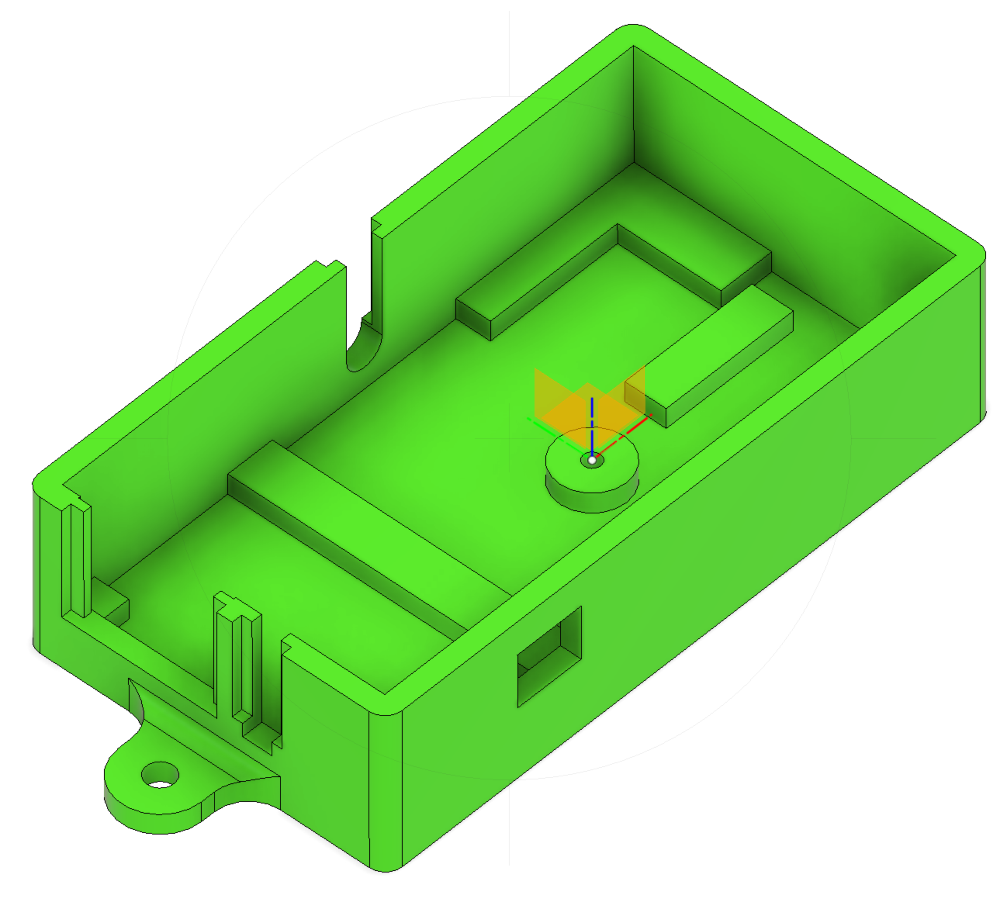
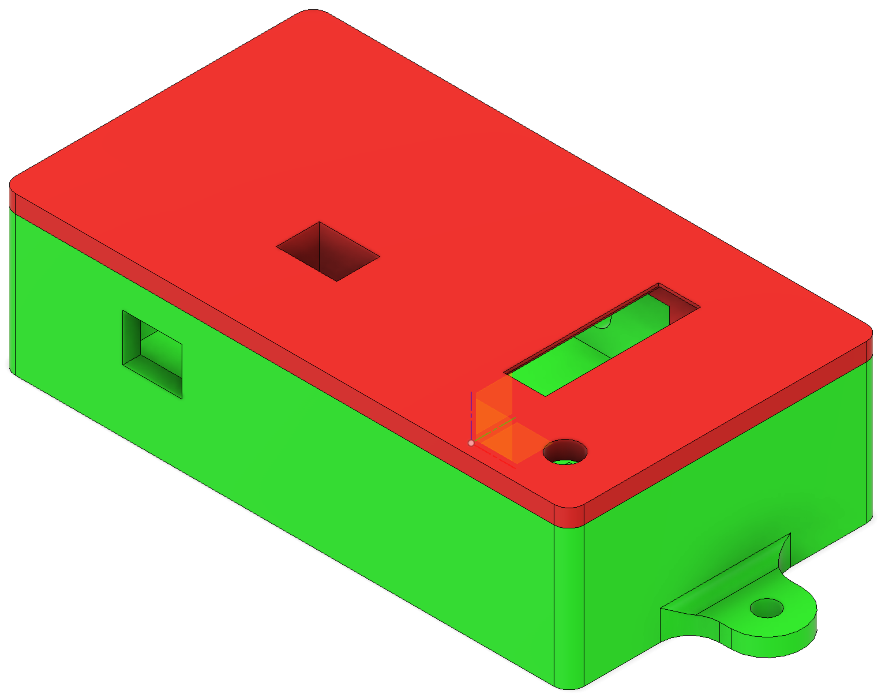

# HixCO2TemperatureIRBlaster - Hardware
The respository contains the EagleCAD file + JLCPCB zip export (in the `/hardware` folder)

| Top                                 | Bottom                                 |
|-------------------------------------|----------------------------------------|
|  |  |

# BOM
## Base
| ID                                 | Part                                                                |
|------------------------------------|----------------------------------------------------------------------
|B1                                  | BUZZER(12MM)     
|C1, C2                              | 47uF (SMD 1206)             
|C3, C5                              | 100nF (SMD 1206)           
|C6                                  | 680uF/6.3V 
|F1                                  | Fuse 800mA 250V       
|J1                                  | Header female 6 pin
|J2                                  | IEC320C8 mains connector         
|J3                                  | Header female 4 pin or XH4P             
|Q1                                  | Mosfet AO3400           
|R2, R7, R10, R11, R15               | 10K (SMD 1206)             
|R9                                  | 4.7K (SMD 1206)
|R12                                 | 2.2K (SMD 1206)  
|R14                                 | S10K275          
|S3, S4                              | SMD Push button     
|U$2                                 | ESP8266(ESP12E)V2
|U$3                                 | RGB LED 5mm          
|U1                                  | TSOP2238      
|U2                                  | LM3940 (SMD)         
|U3                                  | HLK-PM01 (mains to 5v powerbrick)     
|U4                                  | DS18B20 *Eventhough I have designed the PCB to allow mounting a plain TO-92 DS18B20 externally, it seams to be highly inaccurate because (I suspect) it takes over the heat via its leads from the internal of the case/pcb. Therefore it is better to use an external DS18B20 probe. I have included a case design for a plain TO-92 and external sensor probe (with strain relief).*

## IR blasting (optional)
| ID                                 | Part                                                                |
|------------------------------------|----------------------------------------------------------------------
|L1, L2, L3                          | IR LED 100 mA.    -> only assemble the one that points in the direction right for you!
|Q2                                  | Mosfet AO3400           
|R1, R3, R6                          | 68 Ohm (SMD 1206) -> only assemble for the LED that points in the direction right for you!                
|R5                                  | 10K (SMD 1206)       

## IR receiving (optional)
| ID                                 | Part                                                                |
|------------------------------------|----------------------------------------------------------------------
|C4                                  | 4.7uF (SMD 1206) 
|R8                                  | 100 Ohm (SMD 1206)          
|U1                                  | TSOP2238      

# Schematic
The repository contains the EagleCAD (in the `/hardware` folder)

# 3D printed case
(the repository contains the stl files (`/hardware/case` folder)

## external DS18B20 sensor probe
| base                                     | lid                                           |
|------------------------------------------|-----------------------------------------------|
|  |       |
|      |  |

## plain TO-92 DS18B20 sensor

| base                                     | lid                                           |
|------------------------------------------|-----------------------------------------------|
|  |       |
|      |  |
